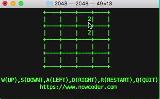

# 项目背景
2048是一个风靡全球的益智类小游戏，通过上下左右控制来合并盘子里的数字，直到盘子里出现2048。

原版体验地址 http://gabrielecirulli.github.io/2048/

作品效果

# 依赖库
- linux: apt-get install libncurses5-dev
- Mac: brew install ncurses
- Windows:
    1. 安装编译器MinGW,https://sourceforge.net/projects/mingw-w64/files/mingw-w64/mingw-w64-release/ 下载mingw-w64-install.exe 5.0.4版本,解压到本地目录，例如 C:\mingw64,然后把C:\mingw64\bin 加入到系统设置的路径里,打开命令行控制台输入g++，确认有这个命令以保证安装是成功
    2. 编译pdcurses库,https://sourceforge.net/projects/pdcurses/files/pdcurses/3.6/pdcurs36.zip/download 下载pdcurses后解压到C:\pdcurs36目录，命令行控制台cd到 C:\pdcurs36\wincon目录，运行 mingw32-make 命令编译pdcurses库，编译成功后目录下有多个demo的exe文件以及一个pdcurses.a文件，这个文件是库文件。

# 开发要点
1. 一次只能合并相邻的两个数字，例如 **[2 2 2 2]** ，向右合并以后是 **[空 空 4 4]** ，不是 **[空 空 空 8]**
2. 每次合并的时候，合并方向优先级高，例如 **[空 2 2 2]**，向右合并以后是 **[空 空 2 4]**，不是 **[空 空 4 2]**
3. 判断游戏胜利或者失败
4. 每次合并以后随机新出4的概率10%

# 编译命令
- Linux/Mac: g++ 2048.cpp -l ncurses -o 2048
- Windows: g++ 2048.cpp C:\pdcurs36\wincon\pdcurses.a -I C:\pdcurs36\ -o 2048

## 注意(wolfdan在windows平台实践添加)
- windows是大写的i，不是l...
- 需要把文件`C:\pdcurs36\curses.h` 移动到和2048.cpp同一个目录下

我windows全移动到了一个目录下,而且因为下载问题，只能下载3.8版本的，所以我的命令是
` g++ 2048.cpp .\pdcurses.a -I .\PDCurses-3.8\ -o 2048`

# 开发步骤
1. [引入curses库](https://git.nowcoder.com/68/2048/blob/f40b7e8cb33b6d5ba9159b51ef3f1c2bd7b8c8a7/2048.cpp)
2. [绘制游戏界面](https://git.nowcoder.com/68/2048/blob/8ef32b89dd706110bb4c3682d66848cc71ca0e02/2048.cpp)
3. [游戏状态切换](https://git.nowcoder.com/68/2048/blob/3c6d4743cb9d4bbf71dd48e5da0afb6d0d95b5a3/2048.cpp)
4. [重启初始化游戏](https://git.nowcoder.com/68/2048/blob/c75ec7027de9952062fbf2504308a8d48ac37c2d/2048.cpp)
5. [向左移动](https://git.nowcoder.com/68/2048/blob/444f66df08072b895e2d77384248b95cb74f3452/2048.cpp)
6. [向其他方向移动](https://git.nowcoder.com/68/2048/blob/37030cb9dba63a35722dedd9df465f4ebc4783c0/2048.cpp)
7. [游戏胜负判定](https://git.nowcoder.com/68/2048/blob/f1dc8e50a3159064c26fb2617425bb3a7b219d8f/2048.cpp)

# 扩展
记录最高分

# 难度
2星，适用于有C++语言基础的同学